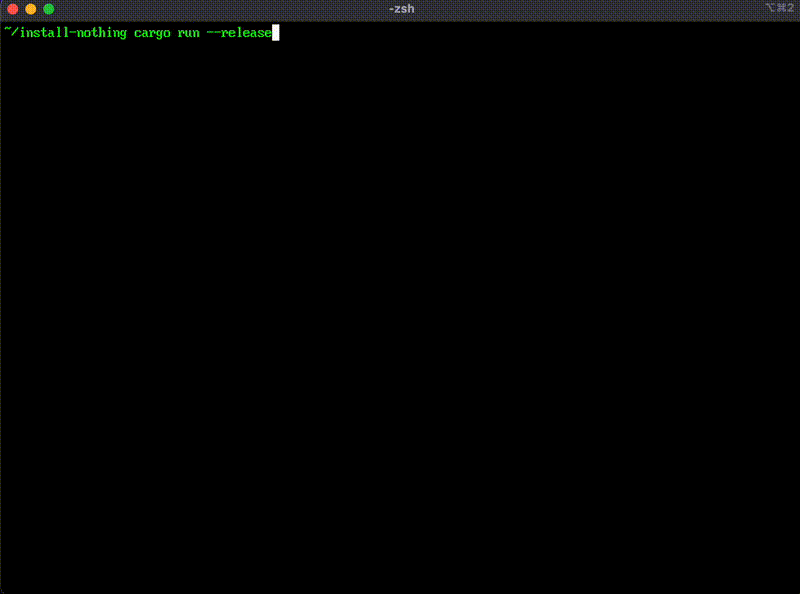

# install-nothing

A terminal application that simulates installing things. It doesn't actually install anything.



## Usage

```bash
cargo build --release
cargo run --release
```

Press Ctrl+C to stop.

## License

Do whatever you want with it.
